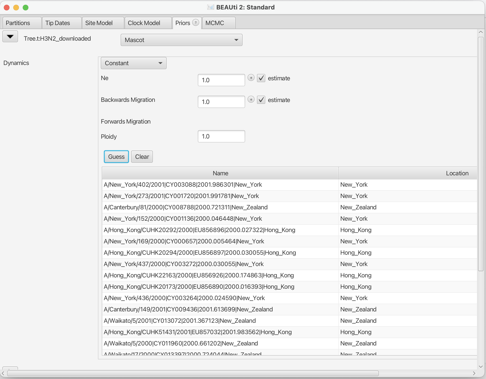

# Background

Phylogeographic methods can help reveal the movement of genes between populations of organisms. This has been widely done to quantify pathogen movement between different host populations, the migration history of humans, and the geographic spread of languages or the gene flow between species using the location or state of samples alongside sequence data. Phylogenies therefore offer insights into migration processes not available from classic epidemiological or occurrence data alone. 

The structured coalescent on the other hand allows us to coherently model the migration and coalescent process, but current implementations struggle with complex datasets due to the need to infer ancestral migration histories. Thus, approximations to the structured coalescent, which integrate over all ancestral migration histories, have been developed. 

This tutorial gives an introduction into how a MASCOT analysis in BEAST2 can be set-up. MASCOT is short for **M**arginal **A**pproximation of the **S**tructured **C**oalscent**T**

----

# Programs used in this Exercise 

### BEAST2 - Bayesian Evolutionary Analysis Sampling Trees 2

BEAST2 is a free software package for Bayesian evolutionary analysis of molecular sequences using MCMC and strictly oriented toward inference using rooted, time-measured phylogenetic trees . This tutorial uses the BEAST2 version 2.4.2.

### BEAUti - Bayesian Evolutionary Analysis Utility

BEAUti is a graphical user interface tool for generating BEAST2 XML configuration files.


### Tracer

[Tracer](http://tree.bio.ed.ac.uk/software/tracer) is used to summarise the posterior estimates of the various parameters sampled by the Markov chain. This program can be used for visual inspection and assessment of convergence. It helps to quickly view median estimates 95% highest posterior density intervals of the parameters, and calculates the effective sample sizes (ESS) of parameters. It also helps to visualise potential parameter correlations.

### TreeAnnotator 

TreeAnnotator is a program that comes with BEAST2. It allows to summarize the analysis of sampled trees.


----

# Practical: Parameter and State inference using the approximate structured coalescent

In this tutorial we will estimate migration rates, effective population sizes and locations of internal nodes using the marginal approximation of the structured coalescent implemented in BEAST2, Mascot .

The aim is to:

-  Learn how to infer structure from trees with sampling location
-  Get to know how to choose the set-up of such an analysis
-  Get to know the advantages and disadvantages of working with structured trees


## Setting up an analysis in BEAUti
### Loading the template
From the _File_ menu, select _Template >> Mascot_.

<figure>
	<a id="fig:example1"></a>
	
	<figcaption>Figure 1: load the Mascot template.</figcaption>
</figure>

### Loading the Influenza A/H3N2 Sequences (Partitions)

The sequences can be either drag and dropped into BEAUti or added by going to _File >> Import Alignment_. Once the sequences are added, we need to specify the sampling dates and locations. 

### Get the sampling times (Tip Dates)


After clicking the _Auto-configure_ button, the sampling times can be guessed. The sampling times are encoded in the sequences names and are in the third group after splitting on the vertical bar "|". The first group after splitting is the name of the sequence, the second group contains the accession numbers. The third are the sampling times, the fourth are the sampling country and the fourth group contains the sampling US state.

<figure>
	<a id="fig:example1"></a>
	
	<figcaption>Figure 1: Guess sampling times.</figcaption>
</figure>

After guessing the sampling times, the column **Date** should now have values between 2000 and 2003 and the column **Height** should have values from 0 to 3. The heights denote the time difference from a sequence to the most recently sampled sequence. If everything is specified correctly, the sequence with Height 0.0 should be have Date 2002.750685. Next, the sampling locations need to be specified.

### Get the sampling locations (Tip Locations)

As for the sampling times, the sampling locations can be guessed from the sequence names. Initialilly the colum **Location** should be NOT_SET for every sequence. After clicking the _Guess_ button, you can split the sequence splitting on the vertical bar "|" again. As said before, the locations are in the fourth group. After clicking the _OK_ button, the window should now look likel in the figure below

<figure>
	<a id="fig:example1"></a>
	
	<figcaption>Figure 1: Guess sampling locations.</figcaption>
</figure>

### Specify the Site Model (Site Model)

Next, we have to specify the site model. For Influenza Hemagluttanin sequences as we have here, HKY is the most commonly used model of nucleotide evolution. It allows for difference in transversion and transition rates. Meaning that changes between bases that are chemically closer related (transitions) are allowed to have a different rate than changes between bases that chemically more distinct (transversion).

<figure>
	<a id="fig:example1"></a>
	
	<figcaption>Figure 1: Guess sampling times.</figcaption>
</figure>


-------

# Tutorial style guide

## Text styling

This is how to write _italic text_.

This is how to write **bold text**.

This is how to write **_bold and italic text_**.

Do text superscripts like this 7^th, x^2y or  x^(2y + 3z).


## Lists

### Unnumbered lists

- Lorem ipsum dolor sit amet, consectetur adipiscing elit.
- Integer pharetra arcu ut nisl mollis ultricies.
	- Fusce nec tortor at enim cursus dictum.
	- Phasellus nec urna quis velit eleifend convallis sodales nec augue.
- In iaculis turpis in massa facilisis, quis ultricies nibh ultricies.
- Nam vitae turpis eu lacus imperdiet mollis id at augue.
- Sed sed turpis ac dolor mollis accumsan.


### Numbered lists

1. Lorem ipsum dolor sit amet, consectetur adipiscing elit.
2. Integer pharetra arcu ut nisl mollis ultricies.
	1. Fusce nec tortor at enim cursus dictum.
	2. Phasellus nec urna quis velit eleifend convallis sodales nec augue.
1. In iaculis turpis in massa facilisis, quis ultricies nibh ultricies.
1. Nam vitae turpis eu lacus imperdiet mollis id at augue.
1. Sed sed turpis ac dolor mollis accumsan.

### Mixed lists

1. Lorem ipsum dolor sit amet, consectetur adipiscing elit.
2. Integer pharetra arcu ut nisl mollis ultricies.
	* Fusce nec tortor at enim cursus dictum.
	* Phasellus nec urna quis velit eleifend convallis sodales nec augue.
1. In iaculis turpis in massa facilisis, quis ultricies nibh ultricies.
1. Nam vitae turpis eu lacus imperdiet mollis id at augue.
1. Sed sed turpis ac dolor mollis accumsan.


## Figures


<figure>
	<a id="fig:example1"></a>
	
	<figcaption>Figure 1: This figure is 25% of the page width.</figcaption>
</figure>


<figure>
	<a id="fig:example2"></a>
	
	<figcaption>Figure 2: This figure is only 10% of the page width.</figcaption>
</figure>


# Code

A bit of inline monospaced font can be made `like this`. Larger code blocks can be made by using the code environment:

Java:

```java
public class HelloWorld {

    public static void main(String[] args) {
        // Prints "Hello, World" to the terminal window.
        System.out.println("Hello, World");
    }

}
```

XML:

```xml
	<BirthDeathSkylineModel spec="BirthDeathSkylineModel" id="birthDeath" tree="@tree" contemp="true">
	      <parameter name="origin" id="origin" value ="100" lower="0."/>    
	      <parameter name="R0" id="R0" value="2" lower="0." dimension ="10"/>
	      <parameter name="becomeUninfectiousRate" id="becomeUninfectiousRate" value="1" lower="0." dimension ="10"/>
	      <parameter name="samplingProportion" id="samplingProportion" value="0."/>
	      <parameter name="rho" id="rho" value="1e-6" lower="0." upper="1."/>
	</BirthDeathSkylineModel>
```

R:

```R
	> myString <- "Hello, World!"
	> print (myString)
	[1] "Hello, World!"
```

# Equations

Inline equations: 

Displayed equations: 



## Instruction boxes

Use block-quotes for step-by-step instruction that the user should perform (this will produce a framed box on the website):

> The data we have is not the data we want, and the data we need is not the data we have.
> 
> We can input **any** formatted text in here:
>
> - Even
> - Lists
>
> or equations:
>
> 


# Hyperlinks

Add links to figures like this: 

- [Figure 1](#fig:example1) is 25% of the page width.
- [Figure 2](#fig:example2) is 10% of the page width. 

Add links to external URLs like [this](http://www.google.com). 

Links to equations or different sections within the same document are a little buggy.


----

# Useful Links

- [Bayesian Evolutionary Analysis with BEAST 2](http://www.beast2.org/book.html) 
- BEAST 2 website and documentation: [http://www.beast2.org/](http://www.beast2.org/)
- BEAST 1 website and documentation: [http://beast.bio.ed.ac.uk](http://beast.bio.ed.ac.uk)
- Join the BEAST user discussion: [http://groups.google.com/group/beast-users](http://groups.google.com/group/beast-users) 

----

# Relevant References


