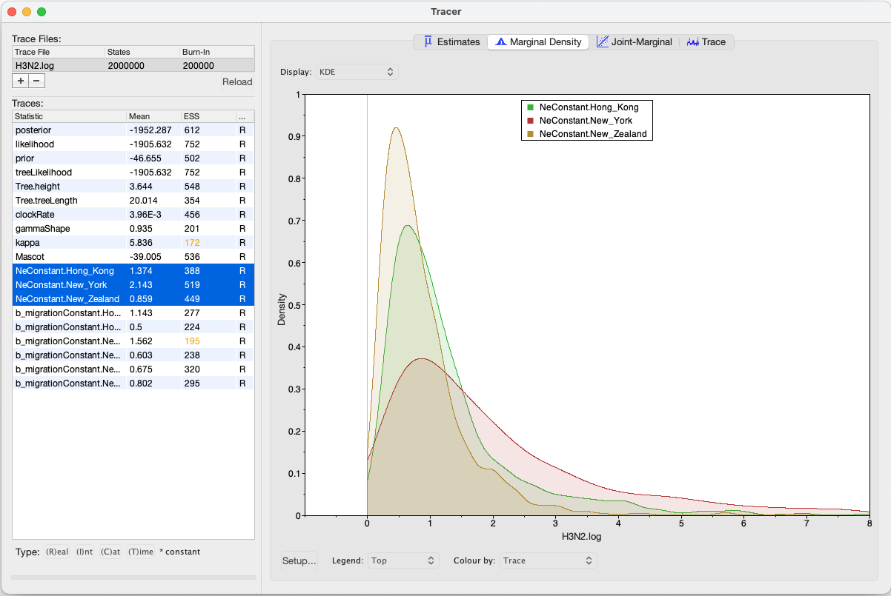

# Background

Phylogeographic methods can help reveal the movement of genes between populations of organisms. This has been widely done to quantify pathogen movement between different host populations, the migration history of humans, and the geographic spread of languages or the gene flow between species using the location or state of samples alongside sequence data. Phylogenies therefore offer insights into migration processes not available from classic epidemiological or occurrence data alone. 

The structured coalescent on allows to coherently model the migration and coalescent process, but current implementations struggle with complex datasets due to the need to infer ancestral migration histories. Thus, approximations to the structured coalescent, which integrate over all ancestral migration histories, have been developed. This tutorial gives an introduction into how a MASCOT analysis in BEAST2 can be set-up. MASCOT is short for **M**arginal **A**pproximation of the **S**tructured **CO**alscent**T** and implements a structured coalescent approximation introduced [here](https://academic.oup.com/mbe/article/doi/10.1093/molbev/msx186/3896419/The-Structured-Coalescent-and-its-Approximations). This approximation doesn't require migration histories to be sampled using MCMC and therefore allows to analyse phylogenies with more than three or four states.

----

# Programs used in this Exercise 

### BEAST2 - Bayesian Evolutionary Analysis Sampling Trees 2

BEAST2 is a free software package for Bayesian evolutionary analysis of molecular sequences using MCMC and strictly oriented toward inference using rooted, time-measured phylogenetic trees . This tutorial uses the BEAST2 version 2.4.2.

### BEAUti - Bayesian Evolutionary Analysis Utility

BEAUti is a graphical user interface tool for generating BEAST2 XML configuration files.

### Tracer

[Tracer](http://tree.bio.ed.ac.uk/software/tracer) is used to summarise the posterior estimates of the various parameters sampled by the Markov chain. This program can be used for visual inspection and assessment of convergence. It helps to quickly view median estimates 95% highest posterior density intervals of the parameters, and calculates the effective sample sizes (ESS) of parameters. It also helps to visualise potential parameter correlations.

### TreeAnnotator 

TreeAnnotator is a program that comes with BEAST2. It allows to summarize the analysis of sampled trees.

----

# Practical: Parameter and State inference using the approximate structured coalescent

In this tutorial we will estimate migration rates, effective population sizes and locations of internal nodes using the marginal approximation of the structured coalescent implemented in BEAST2, Mascot .

The aim is to:

-  Learn how to infer structure from trees with sampling location
-  Get to know how to choose the set-up of such an analysis
-  Learn how to read the output of a MASCOT analysis

## Setting up an analysis in BEAUti

### Download Mascot
First, we have to download the package Mascot using the BEAUTi package manager. Go to _File >> Manage Packages_ and download the package Mascot

<figure>
	
	
	<figcaption>Figure 1: Download the Mascot package.</figcaption>
</figure>

### Loading the template
Next, we have to load the BEAUTi template from _File_, select _Template >> Mascot_.

### Loading the Influenza A/H3N2 Sequences (Partitions)

The sequences can be either drag and dropped into BEAUti or added by going to _File >> Import Alignment_. Once the sequences are added, we need to specify the sampling dates and locations. 

### Get the sampling times (Tip Dates)

After clicking the _Auto-configure_ button, the sampling times can be guessed. The sampling times are encoded in the sequences names and are in the third group after splitting on the vertical bar "|". The first group after splitting is the name of the sequence, the second group contains the accession numbers. The third are the sampling times, the fourth are the sampling location.

<figure>
	
	
	<figcaption>Figure 2: Guess sampling times.</figcaption>
</figure>

After guessing the sampling times, the column **Date** should now have values between 2000 and 2002 and the column **Height** should have values from 0 to 2. The heights denote the time difference from a sequence to the most recently sampled sequence. If everything is specified correctly, the sequence with Height 0.0 should be have Date 2001.9... . Next, the sampling locations need to be specified.

### Get the sampling locations (Tip Locations)

As for the sampling times, the sampling locations can be guessed from the sequence names. Initialilly the colum **Location** should be NOT_SET for every sequence. After clicking the _Guess_ button, you can split the sequence splitting on the vertical bar "|" again. As said before, the locations are in the fourth group. After clicking the _OK_ button, the window should now look like in the figure below:

<figure>
	
	
	<figcaption>Figure 3: Guess sampling locations.</figcaption>
</figure>

### Specify the Site Model (Site Model)

Next, we have to specify the site model. For Influenza Hemagluttanin sequences as we have here, HKY is the most commonly used model of nucleotide evolution. It allows for difference in transversion and transition rates. Meaning that changes between bases that are chemically closer related (transitions) are allowed to have a different rate than changes between bases that chemically more distinct (transversion). Additionally, we should allow for different rate categories for different sires in the alignment. This can be done by setting the _Gamma Category Count_ to 4, which is just a value that has typically been used. To reduce the number of parameters we have to estimate, we can set Frequencies to Empirical.

<figure>
	
	
	<figcaption>Figure 4: Set the site model.</figcaption>
</figure>

### Set the clock model (Clock Model)

### Specify the priors and set dimensions (Priors)
Now we need to set the priors as well as the dimensions of the effective population sizes and the migration rates. For this example we have sequences from Hong Kong, New Zealand and, New York . Overall we have three different locations, meaning that we need an effective popualtions size for each of these locations. You can set the dimension of the effective population size by pressing the _initial_ button. A window will then appear where you can set the dimension to 1. Next, we can change the prior to a Log Normal prior with M=0 and S=1. Since we have only a few sample per location, meaning little information about the different effective population sizes, we will need a strong prior.

<figure>
	
	
	<figcaption>Figure 5: Set the dimension for the effective population sizes to 3.</figcaption>
</figure>

Next, we have to set the dimension of the migration rate parameter. A lineage from any of the 3 locations can migrate to 2 (3-1) other locations. Overall, we therefor have to estimate 3*(3-1) migration rates and have to set the dimension accordingly. The exponential distribution as a prior on the migration rate puts much weight on lower values while not prohibiting larger ones.

<figure>
	
	
	<figcaption>Figure 6: Set the dimension of the migration rates to 6.</figcaption>
</figure>

Next, we have to set a prior for the clock rate. Since we only have a narrow time window of less than a year and only 24 sequences, there isn't much information in the data about the clock rate. We have however a good idea about it for Influenza A/H3N2 Hemagglutinin. We can therefor set the prior to be normally distributed around 0.005 substitution per site and year with a variance of 0.0001. (At this point we could also just fix the rate)

### Specify the MCMC chain length (MCMC)

Here we can set the length of the MCMC chain and after how many iterations the parameter and trees a logged. For this dataset, 2 million iterations should be sufficient. In order to have enough samples but not create too large files, we can set the logEvery to 5000, so we have 400 samples before burin. Next, we have to save the *.xml file under _File >> Save as_.

<figure>
	
	
	<figcaption>Figure 7: save the \*.xml.</figcaption>
</figure>

### Run the Analysis using BEAST2
Run the \*.xml using BEAST2 or use finished runs from the *precooked-runs* folder. The analysis should take about 6 minutes. 

### Analyse the log file using Tracer

First, we can open the \*.log file in tracer to check if the MCMC has converged. The ESS value should be above 200 for each of the values. In fact, having half the number of iterations for the MCMC would have been sufficient. 

<figure>
	
	
	<figcaption>Figure 8: Check if the posterior converged.</figcaption>
</figure>

Next, we can have a look at the inferred effective population sizes. New York is inferred to have the larger effective population size before Hong Kong and New Zealand. This tells us that two lineages that are in the New Zealand are expected to coalesce quicker than two lineages in Hong Kong or New York.

<figure>
	
	
	<figcaption>Figure 9: Compare the different inferred effective population sizes.</figcaption>
</figure>

In this example, we have relatively little information about the effective population sizes of each location. This can lead to estimates that are greatly informed by the prior. Additionally, there can be great differences between median and mean estimates. The median estimates are generally more reliable since they are less influence by extreme values. 

<figure>
	
	
	<figcaption>Figure 10: Differences between Mean and Meadian estimates.</figcaption>
</figure>

We then can look at the inferred migration rates. The migration rates have the lable b_migration.*, meaning that they are backwards in time migration rates. The highest rates are from New York to Hong Kong. Because they are backwards in time migration rates, this means that lineage from New York are inferred to be likely from Hong Kong if we're going backwards in time. In the inferred phylogenies, we should therefor make the observation that a lot ancestral lineages are inferred to be from the Hong Kong backwards.

<figure>
	
	
	<figcaption>Figure 11: Compare the inferrred migration rates.</figcaption>
</figure>

### Make the mcc tree using TreeAnnotator
Next, we want to summarize the trees. This we can do using treeAnnotator. Open the programm and then set the options as below. You have to specify the _Burnin precentage_, the _Node heights_, _Input Tree File_ and the _Output File_ after clicking _Run_ the programm should summarize the trees.

<figure>
	
	
	<figcaption>Figure 12: Make the maximum clade credibility tree.</figcaption>
</figure>

### Check the mcc tree using FigTree
We can now open the mcc tree using FigTree. The output contains several things. Each node has several traits. Among them are those called Hong_Kong, New_York and New_Zealand. The value of those traits is the probability of that node being in that location as inferred using MASCOT. 

<figure>
	
	
	
	
	<figcaption>Figure 13: Compare the inferred node probabilities.</figcaption>
</figure>

----

# Useful Links

- [Bayesian Evolutionary Analysis with BEAST 2](http://www.beast2.org/book.html) 
- BEAST 2 website and documentation: [http://www.beast2.org/](http://www.beast2.org/)
- BEAST 1 website and documentation: [http://beast.bio.ed.ac.uk](http://beast.bio.ed.ac.uk)
- Join the BEAST user discussion: [http://groups.google.com/group/beast-users](http://groups.google.com/group/beast-users) 

----

# Relevant References


