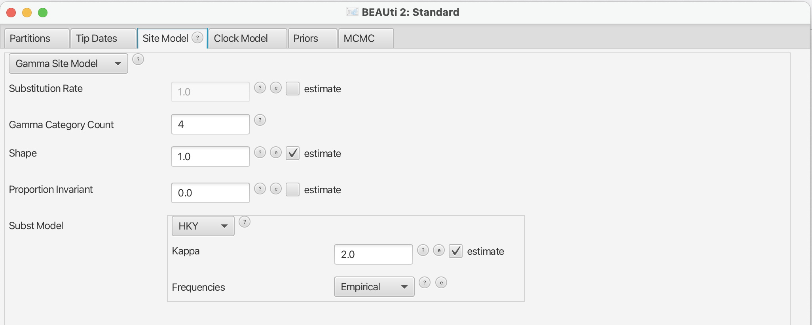

# Background

Phylogeographic methods can help reveal the movement of genes between populations of organisms. This has been widely done to quantify pathogen movement between different host populations, the migration history of humans, and the geographic spread of languages or the gene flow between species using the location or state of samples alongside sequence data. Phylogenies therefore offer insights into migration processes not available from classic epidemiological or occurrence data alone. 

The structured coalescent on the other hand allows us to coherently model the migration and coalescent process, but current implementations struggle with complex datasets due to the need to infer ancestral migration histories. Thus, approximations to the structured coalescent, which integrate over all ancestral migration histories, have been developed. 

This tutorial gives an introduction into how a MASCOT analysis in BEAST2 can be set-up. MASCOT is short for **M**arginal **A**pproximation of the **S**tructured **C**oalscent**T**

----

# Programs used in this Exercise 

### BEAST2 - Bayesian Evolutionary Analysis Sampling Trees 2

BEAST2 is a free software package for Bayesian evolutionary analysis of molecular sequences using MCMC and strictly oriented toward inference using rooted, time-measured phylogenetic trees . This tutorial uses the BEAST2 version 2.4.2.

### BEAUti - Bayesian Evolutionary Analysis Utility

BEAUti is a graphical user interface tool for generating BEAST2 XML configuration files.

### Tracer

[Tracer](http://tree.bio.ed.ac.uk/software/tracer) is used to summarise the posterior estimates of the various parameters sampled by the Markov chain. This program can be used for visual inspection and assessment of convergence. It helps to quickly view median estimates 95% highest posterior density intervals of the parameters, and calculates the effective sample sizes (ESS) of parameters. It also helps to visualise potential parameter correlations.

### TreeAnnotator 

TreeAnnotator is a program that comes with BEAST2. It allows to summarize the analysis of sampled trees.

----

# Practical: Parameter and State inference using the approximate structured coalescent

In this tutorial we will estimate migration rates, effective population sizes and locations of internal nodes using the marginal approximation of the structured coalescent implemented in BEAST2, Mascot .

The aim is to:

-  Learn how to infer structure from trees with sampling location
-  Get to know how to choose the set-up of such an analysis
-  Get to know the advantages and disadvantages of working with structured trees

## Setting up an analysis in BEAUti
### Loading the template
From the _File_ menu, select _Template >> Mascot_.

<figure>
	
	
	<figcaption>Figure 1: load the Mascot template.</figcaption>
</figure>

### Loading the Influenza A/H3N2 Sequences (Partitions)

The sequences can be either drag and dropped into BEAUti or added by going to _File >> Import Alignment_. Once the sequences are added, we need to specify the sampling dates and locations. 

### Get the sampling times (Tip Dates)

After clicking the _Auto-configure_ button, the sampling times can be guessed. The sampling times are encoded in the sequences names and are in the third group after splitting on the vertical bar "|". The first group after splitting is the name of the sequence, the second group contains the accession numbers. The third are the sampling times, the fourth are the sampling country and the fourth group contains the sampling US state.

<figure>
	
	
	<figcaption>Figure 1: Guess sampling times.</figcaption>
</figure>

After guessing the sampling times, the column **Date** should now have values between 2000 and 2003 and the column **Height** should have values from 0 to 3. The heights denote the time difference from a sequence to the most recently sampled sequence. If everything is specified correctly, the sequence with Height 0.0 should be have Date 2002.750685. Next, the sampling locations need to be specified.

### Get the sampling locations (Tip Locations)

As for the sampling times, the sampling locations can be guessed from the sequence names. Initialilly the colum **Location** should be NOT_SET for every sequence. After clicking the _Guess_ button, you can split the sequence splitting on the vertical bar "|" again. As said before, the locations are in the fourth group. After clicking the _OK_ button, the window should now look likel in the figure below

<figure>
	
	
	<figcaption>Figure 1: Guess sampling locations.</figcaption>
</figure>

### Specify the Site Model (Site Model)

Next, we have to specify the site model. For Influenza Hemagluttanin sequences as we have here, HKY is the most commonly used model of nucleotide evolution. It allows for difference in transversion and transition rates. Meaning that changes between bases that are chemically closer related (transitions) are allowed to have a different rate than changes between bases that chemically more distinct (transversion).

<figure>
	
	
	<figcaption>Figure 1: Set the site model.</figcaption>
</figure>

### Set the clock model (Clock Model)

### Specify the priors and set dimensions (Priors)
Now we need to set the priors as well as the dimensions of the effective population sizes and the migration rates. For this example we have sequences from Australia, Hong Kong, New Zealand and, New York (USA). Overall we have four different locations, meaning that we need and effective popualtions size for each of these locations. You can set the dimension of the effective population size by pressing the _initial_ button. A window will then appear where you can set the dimension to 1. Next, we can change the prior to a Log Normal prior with M=0 and S=4. An exponential distribution would be favoring small values of Ne's, whereas a Log Normal distribution is less informative.

<figure>
	
	
	<figcaption>Figure 1: Set the site model.</figcaption>
</figure>

Next, we have to set the dimension of the migration rate parameter. A lineage from any of the 4 locations can migrate to 3 (4-1) other locations. Overall, we therefor have to estimate 4*(4-1) migration rates and have to set the dimension accordingly. The exponential distribution as a prior on the migration rate puts much weight on lower values while not prohibiting larger ones.

<figure>
	
	
	<figcaption>Figure 1: Set the site model.</figcaption>
</figure>

Next, we have to set a prior for the clock rate. Since we only have a narrow time window of less than a year and only 80 sequences, there isn't much information in the data about the clock rate. We have however a good idea about it for Influenza A/H3N2 Hemagglutinin. We can therefor set the prior to be normally distributed around 0.005 substitution per site and year with a variance of 0.0001. (At this point we could also fix the rate, but this would require deleting the operators in the xml that act on the clock rate)

### Specify the MCMC chain length (MCMC)

Here we can set the length of the MCMC chain and after how many iterations the parameter and trees a logged. For this dataset, 5 million iterations should be sufficient. In order to avoid producing to large log a trees files, we can set the logEvery to 10000. Next, we have to save the *xml file under _File >> Save as_.

<figure>
	
	
	<figcaption>Figure 1: load the Mascot template.</figcaption>
</figure>

### Run the Analysis using BEAST2 (MCMC)
Run the \*.xml using BEAST2 to test if the xml is actually working and then either use finished runs from the *precooked-runs* folder.

### Analyse the log file using Tracer

First, we can open the \*.log file in tracer to check if the MCMC has converged

<figure>
	
	
	<figcaption>Figure 1: load the Mascot template.</figcaption>
</figure>

<figure>
	
	
	<figcaption>Figure 1: load the Mascot template.</figcaption>
</figure>

<figure>
	
	
	<figcaption>Figure 1: load the Mascot template.</figcaption>
</figure>

### Make the mcc tree using TreeAnnotator

### look at the mcc tree using FigTree

<figure>
	
	
	<figcaption>Figure 1: load the Mascot template.</figcaption>
</figure>
<figure>
	
	
	<figcaption>Figure 1: load the Mascot template.</figcaption>
</figure>
<figure>
	
	
	<figcaption>Figure 1: load the Mascot template.</figcaption>
</figure>

----

# Useful Links

- [Bayesian Evolutionary Analysis with BEAST 2](http://www.beast2.org/book.html) 
- BEAST 2 website and documentation: [http://www.beast2.org/](http://www.beast2.org/)
- BEAST 1 website and documentation: [http://beast.bio.ed.ac.uk](http://beast.bio.ed.ac.uk)
- Join the BEAST user discussion: [http://groups.google.com/group/beast-users](http://groups.google.com/group/beast-users) 

----

# Relevant References


