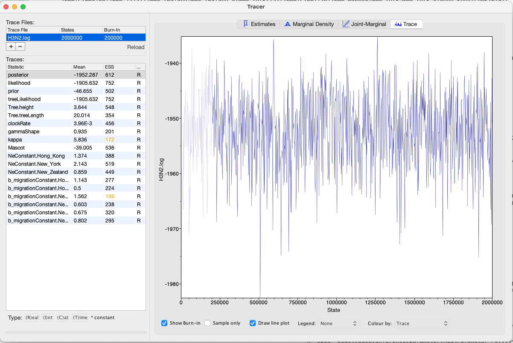

# Background

Phylogeographic methods can help reveal the movement of genes between populations of organisms. This has been widely used to quantify pathogen movement between different host populations, the migration history of humans, and the geographic spread of languages or the gene flow between species using the location or state of samples alongside sequence data. Phylogenies therefore offer insights into migration processes not available from classic epidemiological or occurrence data alone. 

The structured coalescent allows to coherently model the migration and coalescent process, but struggles with complex datasets due to the need to infer ancestral migration histories. Thus, approximations to the structured coalescent, which integrate over all ancestral migration histories, have been developed. This tutorial gives an introduction into how a MASCOT analysis in BEAST2 can be set-up. MASCOT is short for **M**arginal **A**pproximation of the **S**tructured **CO**alescen **T** and implements a structured coalescent approximation . This approximation doesn't require migration histories to be sampled using MCMC and therefore allows to analyse phylogenies with more than three or four states.

----

# Programs used in this Exercise 

### BEAST2 - Bayesian Evolutionary Analysis Sampling Trees 2

BEAST2 ([http://www.beast2.org](http://www.beast2.org)) is a free software package for Bayesian evolutionary analysis of molecular sequences using MCMC and strictly oriented toward inference using rooted, time-measured phylogenetic trees. This tutorial is written for BEAST v{{ page.beastversion }} . 

### BEAUti2 - Bayesian Evolutionary Analysis Utility

BEAUti2 is a graphical user interface tool for generating BEAST2 XML configuration files.

Both BEAST2 and BEAUti2 are Java programs, which means that the exact same code runs on all platforms. For us it simply means that the interface will be the same on all platforms. The screenshots used in this tutorial are taken on a Mac OS X computer; however, both programs will have the same layout and functionality on both Windows and Linux. BEAUti2 is provided as a part of the BEAST2 package so you do not need to install it separately.

### TreeAnnotator

TreeAnnotator is used to summarise the posterior sample of trees to produce a maximum clade credibility tree. It can also be used to summarise and visualise the posterior estimates of other tree parameters (e.g. node height).

TreeAnnotator is provided as a part of the BEAST2 package so you do not need to install it separately.

### Tracer

Tracer ([http://tree.bio.ed.ac.uk/software/tracer](http://tree.bio.ed.ac.uk/software/tracer)) is used to summarise the posterior estimates of the various parameters sampled by the Markov Chain. This program can be used for visual inspection and to assess convergence. It helps to quickly view median estimates and 95% highest posterior density intervals of the parameters, and calculates the effective sample sizes (ESS) of parameters. It can also be used to investigate potential parameter correlations. We will be using Tracer v{{ page.tracerversion }}.

### FigTree

FigTree ([http://tree.bio.ed.ac.uk/software/figtree](http://tree.bio.ed.ac.uk/software/figtree)) is a program for viewing trees and producing publication-quality figures. It can interpret the node-annotations created on the summary trees by TreeAnnotator, allowing the user to display node-based statistics (e.g. posterior probabilities). We will be using FigTree v{{ page.figtreeversion }}.

----

# Practical: Parameter and State inference using the approximate structured coalescent

In this tutorial we will estimate migration rates, effective population sizes and locations of internal nodes using the marginal approximation of the structured coalescent implemented in BEAST2, MASCOT.

The aim is to:

-  Learn how to infer structure from trees with sampling location
-  Get to know how to choose the set-up of such an analysis
-  Learn how to read the output of a MASCOT analysis

## Setting up an analysis in BEAUti

### Download MASCOT
First, we have to download the package MASCOT using the BEAUTi package manager. Go to _File >> Manage Packages_ and download the package MASCOT. 

<figure>
	
	
	<figcaption>Figure 1: Download the MASCOT package.</figcaption>
</figure>

MASCOT will only be available in BEAUti once you close and restart the program.

### Loading the template
Next, we have to load the BEAUTi template from _File_, select _Template >> Mascot_.

### Loading the Influenza A/H3N2 Sequences (Partitions)

The sequence alignment is in the file [H3N2.nexus](http://github.com/nicfel/Mascot-Tutorial/raw/master/data/H3N2.nexus). Right-click on this link and save it to a folder on your computer. Once downloaded, this file can either be drag-and-dropped into BEAUti or added by using BEAUti's menu system via _File >> Import Alignment_. Once the sequences are added, we need to specify the sampling dates and locations. 

### Get the sampling times (Tip Dates)

Open the "Tip Dates" panel and then select the "Use tip dates" checkbox.

The sampling times are encoded in the sequence names.  We can tell BEAUti to use these by clicking the _Auto-configure_ button. The sampling times appear following the third vertical bar "|" in the sequence name. To extract these times, select "split on character", enter "|" (without the quotes) in the text box immediately to the right, and then select "3" from the drob-down box to the right, as shown in the figure below. 

<figure>
	
	
	<figcaption>Figure 2: Guess sampling times.</figcaption>
</figure>

Clicking "Ok" should now populate the table with the sample times extracted from the sequence names: the column **Date** should now have values between 2000 and 2002 and the column **Height** should have values from 0 to 2. The heights denote the time difference from a sequence to the most recently sampled sequence. If everything is specified correctly, the sequence with Height 0.0 should have Date 2001.9. Next, the sampling locations need to be specified.

### Get the sampling locations (Tip Locations)

As for the sampling times, sampling locations can be extracted from
the sequence names.  Select the "Tip Locations" panel.  Initially the
column **Location** should be NOT_SET for every sequence.  After
clicking the _Guess_ button, you can split the sequence on the
vertical bar "|" again by selecting "split on character" and entering
"|" in the box. However, the locations are in the fourth group, so
this time choose "4" from the drop-down menu. After clicking the _OK_
button, the window should look like the one shown in the figure below:

<figure>
	
	
	<figcaption>Figure 3: Configuring sample locations.</figcaption>
</figure>

### Specify the Site Model (Site Model)

Next, we have to specify the site model. To do this, choose the "Site Model" tab. For Influenza Hemagluttanin sequences as we have here, HKY is the most commonly used model of nucleotide evolution. This model allows for differences in transversion and transition rates, meaning that changes between bases that are chemically more closely related (transitions) are allowed to have a different rate to changes between bases that chemically more distinct (transversions). Additionally, we should allow for different rate categories for different sires in the alignment. This can be done by setting the _Gamma Category Count_ to 4, which is just a value that has typically been used. Make sure that estimate is checked next to the shape parameter. To reduce the number of parameters we have to estimate, we can set Frequencies to Empirical.

<figure>
	
	
	<figcaption>Figure 4: Set the site model.</figcaption>
</figure>

### Set the clock model (Clock Model)

For rapidly evolving viruses, the assumption of a strict molecular clock is often made, meaning that the molecular clock is the same on each branch of the phylogeny. To decrease the burnin phase, we can set the initial value to 0.005.

<figure>
	
	
	<figcaption>Figure 5: Set the initial clock rate.</figcaption>
</figure>

### Specify the priors (Priors)
Now, we need to set the priors for the various parameters of the model. We do this by switching to the "Priors" tab.

First, consider the effective population size parameter.  Since we have only a few samples per location, meaning little information about the different effective population sizes, we will need an informative prior. In this case we will use a log normal prior with parameters M=0 and S=1.  (These are respectively the mean and variance of the corresponding normal distribution in log space.)  To use this prior, choose "Log Normal" from the dropdown menu to the right of the Ne.t:H3N2 parameter label, then click the arrow to the left of the same label and fill in the parameter values appropriately (i.e. M=0 and S=1.). Ensure that the "mean in real space" checkbox remains unchecked.

The existing exponential distribution as a prior on the migration rate puts much weight on lower values while not prohibiting larger ones. For migration rates, a prior that prohibits too large values while not greatly distinguishing between very small and very *very* small values is generally a good choice. Be aware however that the exponential distirbution is quite an informative prior: one should be careful that to choose a mean so that feasible rates
are at least within the 95% HPD interval of the prior.  (This can be determined by clicking the arrow to the left of the parameter name and looking at the values below the graph that appears on the right.)

Finally, set the prior for the clock rate. Since we only have a narrow sampling time window of less than two years and only 24 sequences, there isn't much information in the data about the clock rate. We have however a good idea about it for Influenza A/H3N2 Hemagglutinin. We can therefore set the prior to be normally distributed around 0.005 substitution per site per year with a variance of 0.0001. (At this point we could also just fix the rate)

<figure>
	
	
	<figcaption>Figure 6: Set up of the prior distributions.</figcaption>
</figure>

### Specify the MCMC chain length (MCMC)

Now switch to the "MCMC" tab. Here we can set the length of the MCMC
chain and decide how frequently the parameter and trees are
logged. For this dataset, 2 million iterations should be
sufficient. In order to have enough samples but not create too large
files, we can set the logEvery to 5000, so we have 401 samples
overall. Next, we have to save the `*.xml` file using _File >> Save
as_.

<figure>
	
	
	<figcaption>Figure 7: save the *.xml.</figcaption>
</figure>

### Run the Analysis using BEAST2
Run the `*.xml` using BEAST2 or use finished runs from the *precooked-runs* folder. The analysis should take about 6 to 7 minutes. 

### Analyse the log file using Tracer

First, we can open the `*.log` file in tracer to check if the MCMC has converged. The ESS value should be above 200 for almost all values and especially for the posterior estimates.

<figure>
	
	
	<figcaption>Figure 8: Check if the posterior converged.</figcaption>
</figure>

We can have a look at the marginal posterior distributions for the effective population sizes. New York is inferred to have the largest effective population size before Hong Kong and New Zealand. This tells us that two lineages that are in New Zealand are expected to coalesce quicker than two lineages in Hong Kong or New York.

<figure>
	
	
	<figcaption>Figure 9: Compare the different inferred effective population sizes.</figcaption>
</figure>

In this example, we have relatively little information about the effective population sizes of each location. This can lead to estimates that are greatly informed by the prior. Additionally, there can be great differences between median and mean estimates. The median estimates are generally more reliable since they are less influence by extreme values. 

<figure>
	
	
	<figcaption>Figure 10: Differences between Mean and Meadian estimates.</figcaption>
</figure>

We can then look at the inferred migration rates. The migration rates have the label b_migration.*, meaning that they are backwards in time migration rates. The highest rates are from New York to Hong Kong. Because they are backwards in time migration rates, this means that lineages from New York are inferred to be likely from Hong Kong if we're going backwards in time. In the inferred phylogenies, we should therefore make the observation that lineages ancestral to samples from New York are inferred to be from Hong Kong backwards.

<figure>
	
	
	<figcaption>Figure 11: Compare the inferrred migration rates.</figcaption>
</figure>

### Make the MCC tree using TreeAnnotator

Next, we want to summarize the trees. This we can do using TreeAnnotator. Open the program and then set the options as below. You have to specify the _Burnin percentage_, the _Node heights_, _Input Tree File_ and the _Output File_. After clicking _Run_ the program should summarize the trees.

<figure>
	
	
	<figcaption>Figure 12: Make the maximum clade credibility tree.</figcaption>
</figure>

### Examine the MCC tree using FigTree

We can now open the MCC tree using FigTree. To do this, run FigTree and choose _File >> Open_. Using the dialog box, select the file "mcc.trees" generated by TreeAnnotator.

Each node in the displayed tree has several traits. Among them are those called Hong_Kong, New_York and New_Zealand. The value of those traits is the probability of that node being in that location as inferred using MASCOT. To view these probability values, select the "Node Labels" checkbox and click the arrow immediately to the left of this pox to expand it. Selecting Hong_Kong, New_York and New_Zealand from the "Display" drop-down menu will cause the probabilities of the internal nodes being in each of these states to be displayed on the tree, as shown in the figures below.

<figure>
	
	
	
	
	<figcaption>Figure 13: Compare the inferred node probabilities.</figcaption>
</figure>

We can now determine if lineages ancestral to samples from New York are actually inferred to be from Hong Kong, or the probability of the root being in any of the locations. It should here be mentioned that the inference of nodes being in a particular location makes some simplifying assumptions, such as that there are no other locations (i.e. apart from the sampled locations) where lineages could have been.

----

# Useful Links

- MASCOT source code: [https://github.com/nicfel/Mascot](https://github.com/nicfel/Mascot)
- [Bayesian Evolutionary Analysis with BEAST 2](http://www.beast2.org/book.html) 
- BEAST 2 website and documentation: [http://www.beast2.org/](http://www.beast2.org/)
- Join the BEAST user discussion: [http://groups.google.com/group/beast-users](http://groups.google.com/group/beast-users) 

----

# Relevant References



